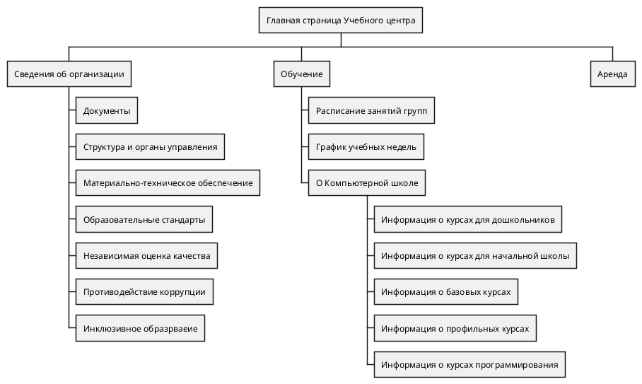
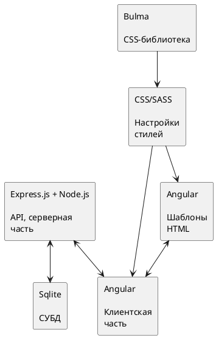
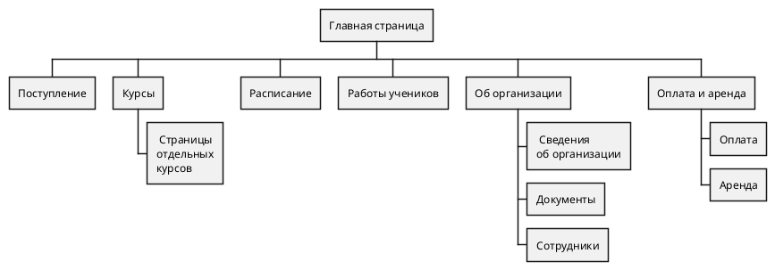
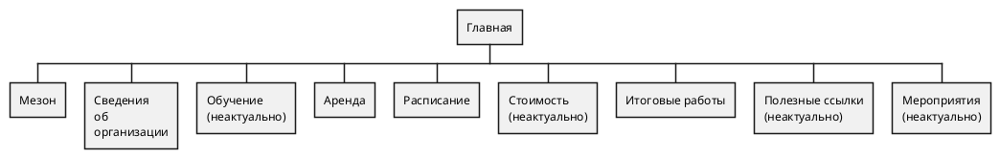
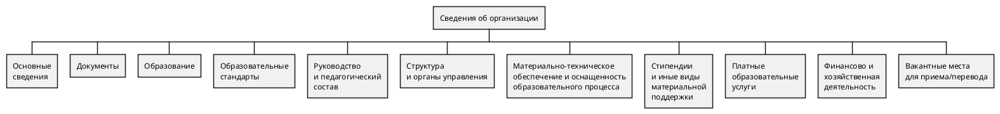
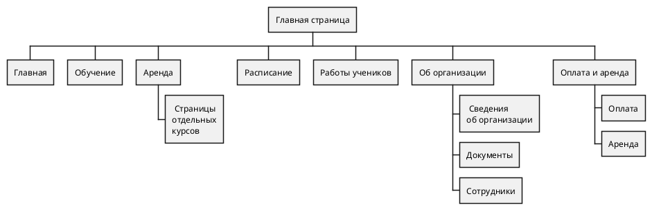
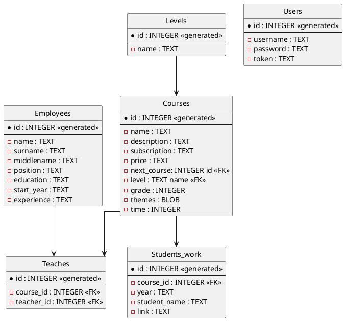
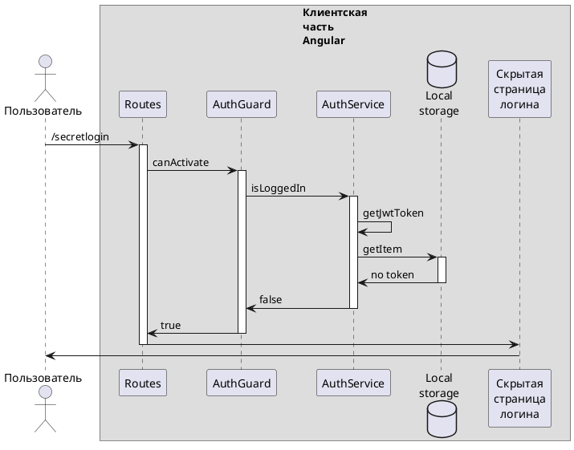

## План наполнения страниц v.1

## Схема функциональных компонентов приложения

## Структурная схема проектируемого веб-ресурса

## OLD ONE
### Главная

### Сведения об организации

## Диаграмма объектов БД

# Клиентская часть
## Логин уже произведен

box "Серверная\nчасть\nNode.js / Express.js"
database "База\nданных" as DB
end box

boundary    Boundary    as Foo2
control     Control     as Foo3
entity      Entity      as Foo4
collections Collections as Foo6
queue       Queue       as Foo7
Foo -> Foo1 : To actor 
Foo -> Foo2 : To boundary
Foo -> Foo3 : To control
Foo -> Foo4 : To entity
Foo -> Foo5 : To database
Foo -> Foo6 : To collections
Foo -> Foo7: To queue

# Сервер ?

