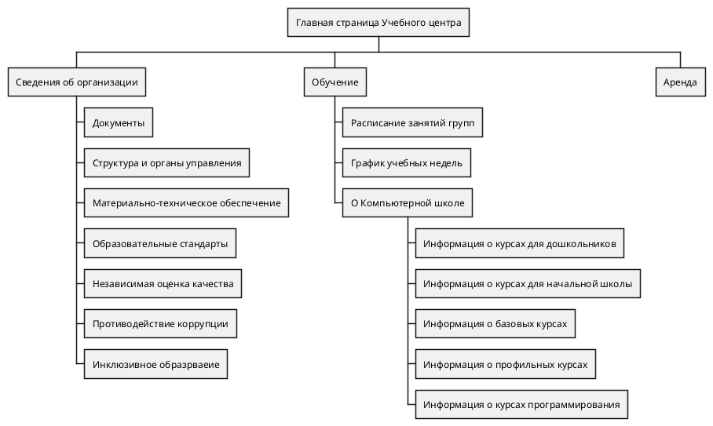
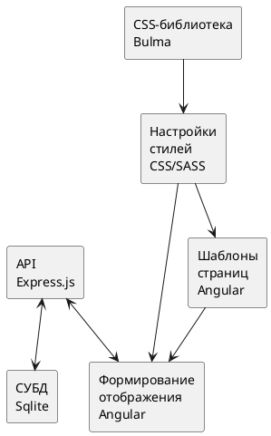
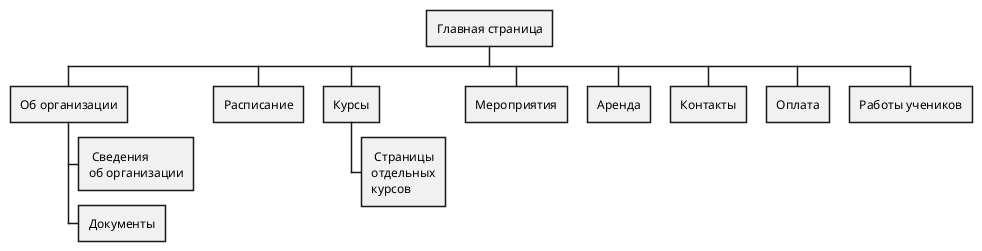
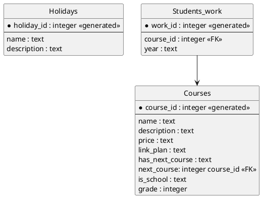

## План наполнения страниц v.1

```plantuml
@startwbs
* Главная страница Учебного центра
** Сведения об организации
*** Документы
*** Структура и органы управления
*** Материально-техническое обеспечение
*** Образовательные стандарты
*** Независимая оценка качества
*** Противодействие коррупции
*** Инклюзивное образрваеие
** Обучение
*** Расписание занятий групп
*** График учебных недель
*** О Компьютерной школе
**** Информация о курсах для дошкольников
**** Информация о курсах для начальной школы
**** Информация о базовых курсах
**** Информация о профильных курсах
**** Информация о курсах программирования
** Аренда
@endwbs
```

## Схема функциональных компонентов приложения

```plantuml
@startuml
skinparam rectangle<<behavior>> {
	roundCorner 25
}

rectangle "СУБД\nSqlite" as DB
rectangle "API\nExpress.js" as EX
rectangle "Формирование\nотображения\nAngular" as Angular
rectangle "Шаблоны\nстраниц\nAngular" as Temp
rectangle "Настройки\nстилей\nCSS/SASS" as CSS

rectangle "CSS-библиотека\nBulma" as Bulma

Bulma --> CSS

EX <--> DB
EX <--> Angular


Temp --> Angular

CSS --> Angular
CSS --> Temp

@enduml
```

## Структурная схема проектируемого веб-ресурса

```plantuml
@startwbs
* Главная страница
** Об организации
***: Сведения
об организации;
*** Документы
** Расписание
** Курсы
***: Страницы
отдельных
курсов;
** Мероприятия
** Аренда
** Контакты
** Оплата
** Работы учеников
@endwbs
```

## Диаграмма объектов БД

```plantuml
@startuml
' hide the spot
hide circle

' avoid problems with angled crows feet
skinparam linetype ortho

entity "Holidays" as Hld {
  *holiday_id : integer <<generated>>
  --
  name : text
  description : text
}

entity "Courses" as Crs {
  *course_id : integer <<generated>>
  --
  name : text
  description : text
  price : text  
  link_plan : text
  has_next_course : text
  next_course: integer course_id <<FK>>
  is_school : text
  grade : integer
}

entity "Students_work" as SW {
  *work_id : integer <<generated>>
  --
  course_id : integer <<FK>>
  year : text
}

SW --> Crs
@enduml
```