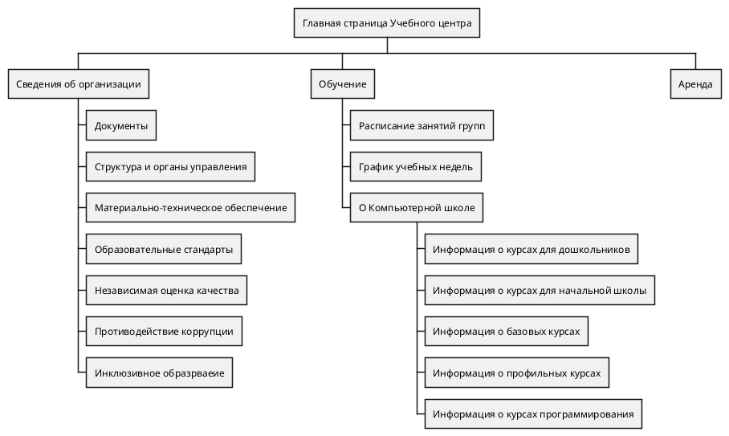
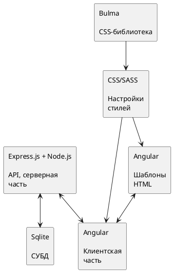
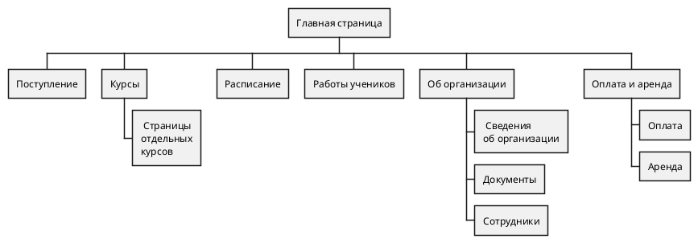
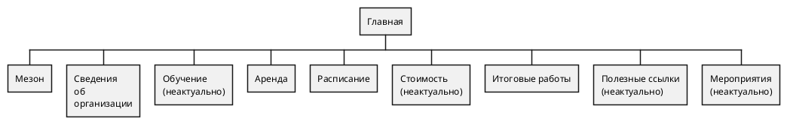
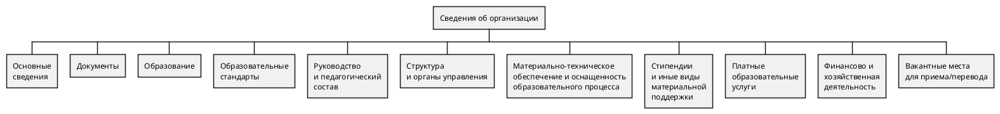
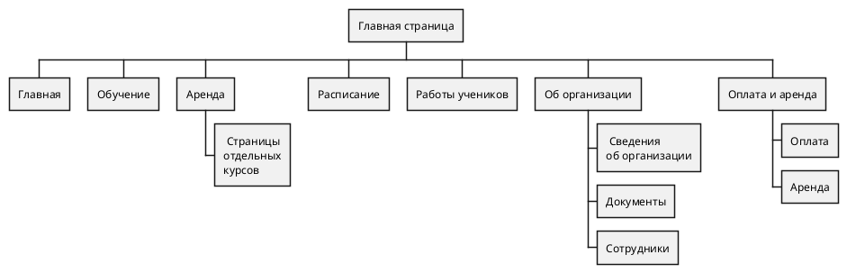
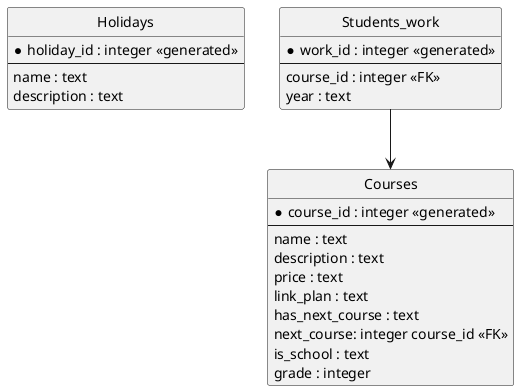

## План наполнения страниц v.1

## Схема функциональных компонентов приложения

## Структурная схема проектируемого веб-ресурса

## OLD ONE
### Главная

### Сведения об организации

## Диаграмма объектов БД

